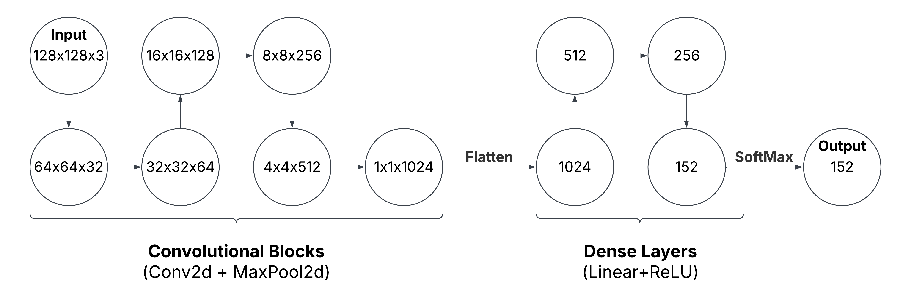
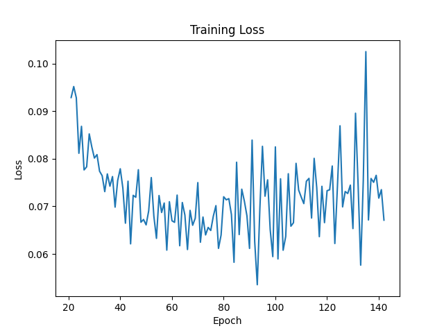
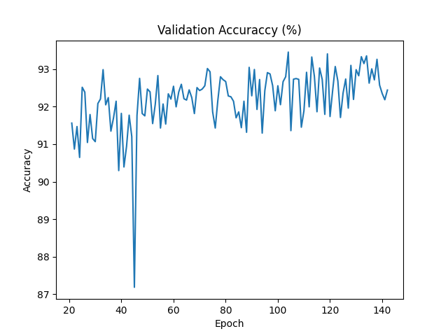

# Project_Sadekar_Suchet_Samir

## Problem Statement

In the Pokemon world, a Pokedex is an electronic encyclopaedia used to record and access
information about the various Pokemon species. It uses a camera to recognise a pok ́emon’s
species and displays their type, strengths, weaknesses, abilities, and other details about
their appearance. My project aims to build a Convolutional Neural Network to identify
a pokemon’s species from an input image. Due to constraints on time and computing power,
only the original 151 pokemon released in the game’s first edition will be considered.  
More details can be found in __Project_Proposal.pdf__  

## Model Architecture  

  

## Data Sources  
[Kaggle Database 1 - Pokemon](https://www.kaggle.com/datasets/noodulz/pokemon-dataset-1000/code)  
[Kaggle Database 2 - Control](https://www.kaggle.com/datasets/rhtsingh/google-universal-image-embeddings-128x128)  
[Metadata](https://pokemondb.net/tools/text-list)  

## Code Specifications

* datset.PokemonDataset():
    * Arguments: Path of data directory, train/val/test sets (leave blank for entire dataset)
* predict.predictor():  
    * Input: List of File Paths
    * Output: List of Pokedex Numbers from 1 to 151, 152 if not a pokemon
* train.trainer():
    * Input: model, num_epochs, train_loader, loss_function, optimizer, val_loader
    * Output: .pth files after each epoch to the checkpoints directory, output.log file with training loss and validation accuracy
* requirements.txt: 
    * use `pip install -r requirements.txt` to install required python packages.

## Accuracy Metrics

  

  
